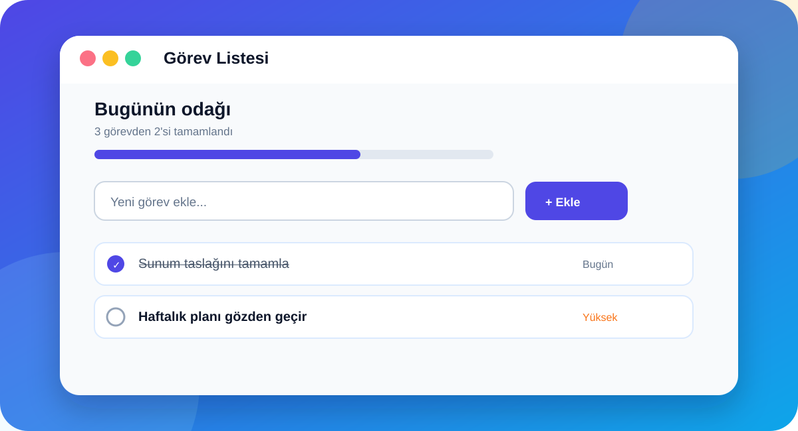

# Görev Listesi

<p align="center">
  
</p>

Öncelik, son tarih, arama ve sürükle-bırak sıralamayı tek bir sakin akışta birleştiren; cihazda çalışan, kurulabilir bir PWA görev yöneticisi.

<p align="center">
  <a href="https://nurettin-erdogan.github.io/todo-app/"><strong>Canlı demoyu aç →</strong></a>
  &nbsp;·&nbsp;
  <a href="#testler">Testler</a>
  &nbsp;·&nbsp;
  <a href="#pwa-ve-veri">PWA ve veri</a>
</p>

## Teknolojiler

- Vanilla JavaScript, HTML ve CSS
- `localStorage` tabanlı cihaz içi kalıcılık
- Service Worker ve Web App Manifest
- Node.js ile paketsiz yerel geliştirme sunucusu
- Playwright smoke testleri ve GitHub Actions CI

## Öne çıkan özellikler

- Görev ekleme, düzenleme, tamamlama ve silme
- Silinen görevleri 5 saniye içinde geri alma
- Düşük, orta ve yüksek öncelik seçenekleri
- Son tarih, bugün, yarın ve gecikme göstergeleri
- Tümü, aktif ve tamamlanan görev filtreleri
- Anlık görev araması
- Bugün ve bu hafta için son tarih görünümü
- Masaüstünde sürükle-bırak ile sıralama
- Toplam, devam eden ve tamamlanan görev istatistikleri
- Tamamlanma ilerleme çubuğu
- Tarayıcıdaki `localStorage` ile kalıcı veri saklama
- Birden fazla sekme arasında otomatik veri eşitleme
- PWA kurulumu ve çevrimdışı açılış desteği
- Uygulama açıkken son tarihi yaklaşan görevler için tarayıcı hatırlatıcıları
- Yeni sürüm hazır olduğunda güvenli güncelleme bildirimi
- Klavye ve ekran okuyucu desteği

## Kurulum ve yerel çalıştırma

En kolay yöntem:

1. `uygulamayi-baslat.bat` dosyasına çift tıklayın.
2. Komut penceresini açık bırakın.
3. Uygulama `http://localhost:5500` adresinde açılır.
4. Kapatmak için komut penceresinde `Ctrl + C` tuşlarına basın.

Alternatif olarak VS Code içinde:

1. Live Server eklentisini kurun.
2. `index.html` dosyasına sağ tıklayın.
3. **Open with Live Server** seçeneğini seçin.

> `index.html` dosyasını doğrudan açmak temel özellikleri çalıştırır; PWA ve çevrimdışı kullanım için yerel sunucu gerekir.

## Nasıl Kullanılır?

1. Üstteki forma görev metnini yazın.
2. İsterseniz son tarih ve öncelik seçin.
3. **Görev Ekle** düğmesine basın.
4. Soldaki kutuyla görevi tamamlandı olarak işaretleyin.
5. **Düzenle** düğmesiyle metni, tarihi veya önceliği değiştirin.
6. Masaüstünde görevleri sürükleyerek sıralayın.
7. Arama alanı ve filtrelerle istediğiniz görevleri bulun.
8. Silme işleminden sonra çıkan **Geri Al** düğmesiyle görevi kurtarın.

## Telefona veya Bilgisayara Kurma

1. Projeyi GitHub Pages gibi HTTPS kullanan bir serviste yayınlayın.
2. Yayınlanan bağlantıyı telefonda açın.
3. Android Chrome'da **Uygulamayı yükle**, iPhone Safari'de **Ana Ekrana Ekle** seçeneğini kullanın.
4. Kurulumdan sonra Görev Listesi bağımsız bir uygulama penceresinde açılır.

## Dosya Yapısı

```text
todo-app/
|-- index.html              Sayfa yapısı
|-- style.css               Tasarım ve responsive kurallar
|-- script.js               Görevler ve kullanıcı etkileşimleri
|-- server.js               Paketsiz yerel geliştirme sunucusu
|-- uygulamayi-baslat.bat   Windows hızlı başlatıcısı
|-- manifest.webmanifest    PWA bilgileri
|-- service-worker.js       Çevrimdışı önbellek yönetimi
|-- icon-192.svg/png        Küçük uygulama ikonları
|-- icon-512.svg/png        Büyük uygulama ikonları
`-- README.md               Proje dokümantasyonu
```

## PWA ve veri

Görevler sunucuya gönderilmez. Veriler kullanılan tarayıcının `localStorage` alanında projeye özel bir anahtarla saklanır. Eski `gorev-listesi.tasks.v1` ve `tasks` kayıtları ilk açılışta otomatik taşınır. Birden fazla sekmede yapılan bağımsız değişiklikler görev bazında birleştirilir. Tarayıcı verileri temizlenirse görevler de silinir.

## Geliştirme Notu

Bu proje saf HTML, CSS ve JavaScript kullanır. Service worker eski dosyaları gösterirse uygulamada beliren **Şimdi Yenile** düğmesini kullanın. Gerekirse tarayıcı geliştirici araçlarından service worker kaydını kaldırıp sayfayı yenileyin.

## Testler

```bash
npm install
npx playwright install chromium
npm test
```

Smoke testi uygulamanın açıldığını, görev eklenebildiğini, tamamlanabildiğini ve silinebildiğini doğrular.
